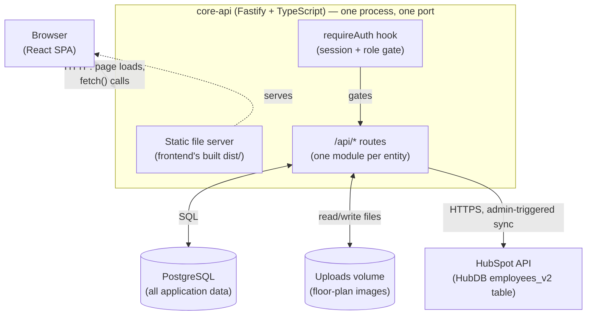
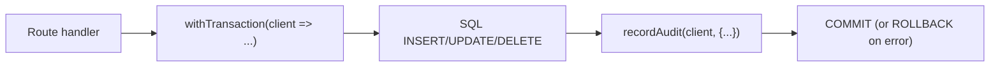
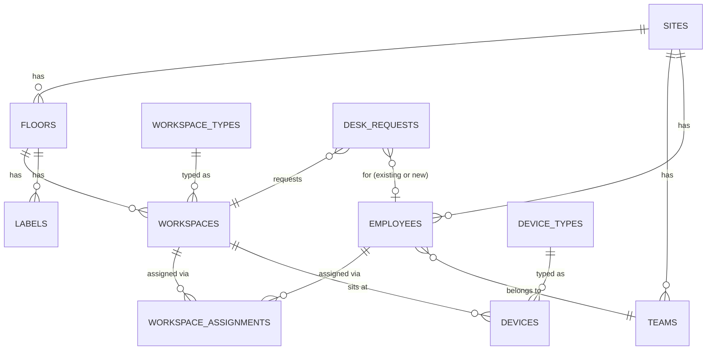
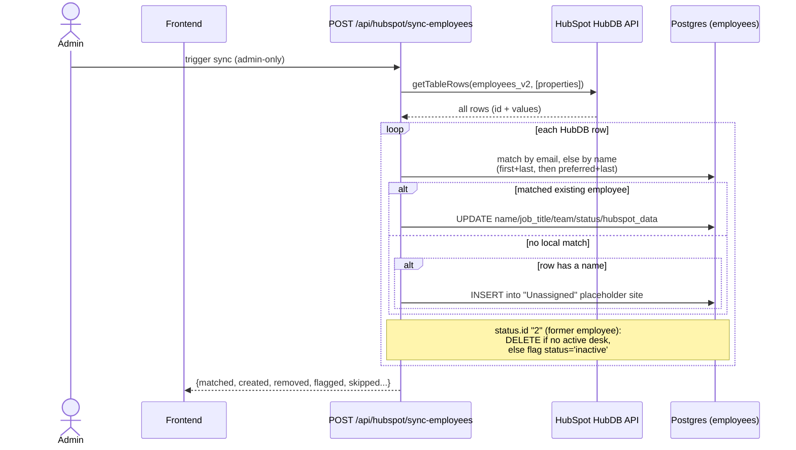
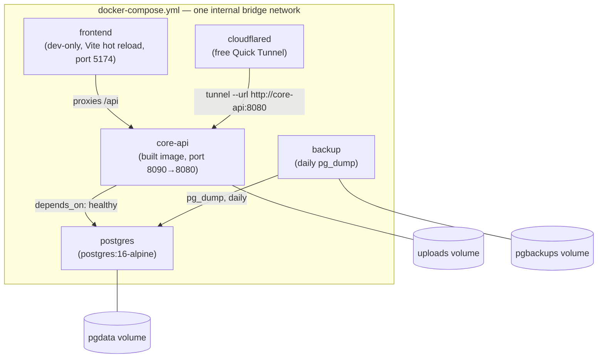
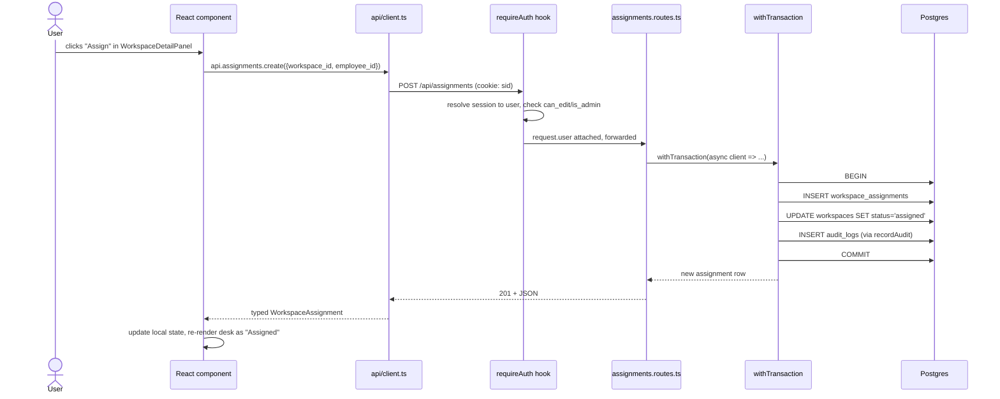
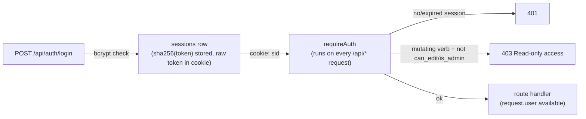
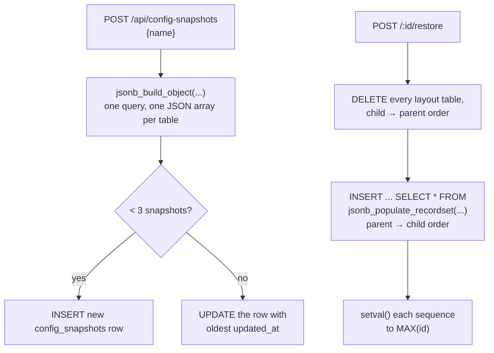
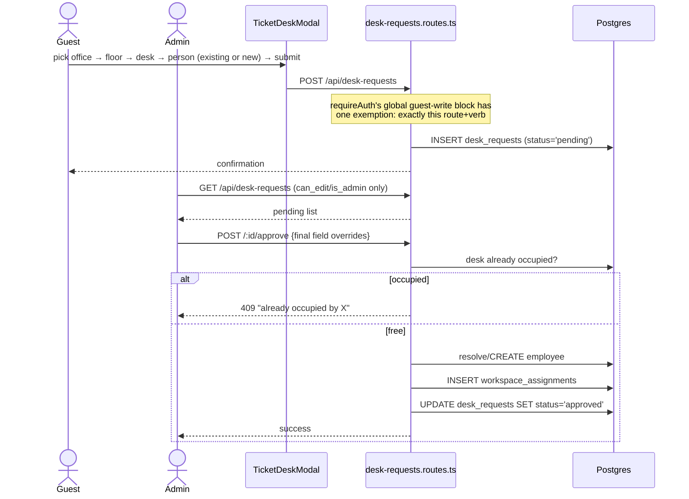

# SmartOffice — Architecture & Workflow

This document explains **how the system is built and how data moves through it** — components, responsibilities, and end-to-end flows. `README.md` covers *what the product does* and *how to run it*; `docs/PROJECT_PLAN.md` covers the original staged roadmap. This one is for a developer who needs to understand the system's shape before touching the code.

All diagrams are [Mermaid](https://mermaid.js.org/) — they render natively on GitHub/GitLab and in VS Code's Markdown preview.

---

## 1. System overview

SmartOffice is a single Fastify process (`core-api`) that serves both the compiled React frontend and the JSON API, backed by Postgres, with one outbound integration (HubSpot) and no other external dependencies.



**Why one process serves both**: this is designed to run on a LAN with no reverse proxy (see `docs/PROJECT_PLAN.md`'s "on-premise, single site" principle). `core-api`'s Fastify instance registers a static file handler for the frontend's build output *and* the `/api/*` routes side by side (`core-api/src/app.ts`). There's a separate `frontend` Docker Compose service, but it's dev-only (Vite dev server with hot reload, proxying `/api` back to `core-api`) — it never runs in the deployed system.

---

## 2. Component responsibilities

### Frontend (`frontend/`)

React 18 + TypeScript + Vite + Tailwind CSS. No Redux/state library — two React Contexts hold shared state:

| Piece | Responsibility |
|---|---|
| `context/AuthContext.tsx` | Current logged-in user, `canEdit` derivation (`is_admin \|\| can_edit`), login/logout |
| `context/AppContext.tsx` | Current site/floor selection, the sidebar's site/floor lists, **and** an app-wide "directory" snapshot (`directoryEmployees`/`directoryWorkspaces`/`directoryAssignments` — every site, not just the current one) used by cross-site search and Ticket Desk |
| `api/client.ts` | The only place that calls `fetch()` — one method per backend route, typed request/response, throws `ApiError` on non-2xx |
| `pages/*.tsx` | One per route: `FloorMapPage`, `PeoplePage`, `UsersPage`, `ConfigSnapshotsPage`, `DeskTicketsPage`, plus the logged-out auth pages |
| `components/FloorMap/*` | The interactive map itself (`FloorMapCanvas` — desks/labels/devices, drag positioning, status/team-color rendering) and its supporting panels/popovers |
| `components/Sidebar.tsx` / `TopBar.tsx` | Navigation and the People Search / Ticket Desk entry points |

**Request pattern**: every page calls `api.<module>.<method>()` → `fetch()` with the session cookie sent automatically (`credentials` default) → on success, local component state is updated directly (no cache layer); a few flows (Ticket Desk approval, config snapshot restore) also call `refreshDirectory()`/`window.location.reload()` to force other parts of the app to pick up data that changed underneath them.

### Backend (`core-api/`)

Fastify 5 + TypeScript, one module per entity under `src/modules/<name>/<name>.routes.ts`, each exporting a `FastifyPluginAsync` registered with a `/api/<name>` prefix in `app.ts`.

Every mutating route follows the same shape:



- `db/transact.ts` — `withTransaction()` wraps a callback in `BEGIN`/`COMMIT`/`ROLLBACK`.
- `db/audit.ts` — `recordAudit()` inserts one `audit_logs` row (entity type/id, action, old/new values, who, source) in the *same* transaction as the actual write, so audit history can never drift from reality.
- `middleware/require-auth.ts` — a global `onRequest` hook: resolves the session cookie to a user, rejects unauthenticated `/api/*` requests, and blocks any mutating verb (`POST`/`PUT`/`PATCH`/`DELETE`) for a user who's neither `is_admin` nor `can_edit` — with one narrow, explicit exception for guest-submitted desk tickets (see §5.4).
- `db/migrations/*.js` — `node-pg-migrate`, raw SQL via `pgm.sql(...)`, applied automatically on container start by `docker-entrypoint.sh` before the server starts.

### Local database (Postgres)

Everything the app knows lives in one Postgres database. Tables fall into four groups:



| Group | Tables | Notes |
|---|---|---|
| **Core directory/layout** | `sites`, `floors`, `workspaces`, `labels`, `teams`, `employees`, `workspace_assignments`, `devices`, `workspace_types`, `device_types` | The data an admin edits directly on the Floor Map / People pages. This is exactly the scope covered by Config Snapshots (§5.3). |
| **Auth** | `users`, `sessions`, `password_reset_tokens`, `invites` | Login accounts — deliberately separate from `employees` (a `users` row *optionally* links to one `employees` row via `employee_id`). Never touched by HubSpot sync or config-snapshot restore. |
| **Workflow / admin tooling** | `desk_requests`, `config_snapshots`, `audit_logs` | Added after the original schema — request queue, saved-state snapshots, and the permanent change log. |
| **Reserved, not yet wired up** | `bookings`, `photos`, `import_logs`, `ingestion_events`, `change_proposals` | Exist in the schema (see `docs/PROJECT_PLAN.md`'s staged roadmap) but have no route module — nothing currently reads or writes them. |

**Why HubSpot data lives inside `employees`, not a separate table**: `employees.hubspot_row_id`, `employees.hubspot_data` (JSONB — the full synced row) and `employees.hubspot_synced_at` are just extra columns on the existing table. A single employee is either purely local, purely HubSpot-sourced, or both merged together — modeling it as one row with optional HubSpot fields avoids a join for every employee read, and the JSONB blob absorbs new HubSpot fields (like `headshot_url`, added later) without a migration.

### HubSpot / HubDB integration

`core-api/src/lib/hubspot.ts` wraps `@hubspot/api-client` and fetches one HubDB table (`employees_v2`, id `131850672`) via `cms.hubdb.rowsApi.getTableRows(...)`, requesting a fixed property list: `first_name`, `last_name`, `preferred_name`, `email`, `role`, `department`, `status`, `mobile_phone_number`, `start_date`, `termination_date`, `registered`, `headshot_url`.



Key rules baked into this route (`core-api/src/modules/hubspot/hubspot.routes.ts`):
- **Matching** tries email first, then an exact-name fallback (only against local employees with no email on file, and only when the name is unambiguous) — first with legal first+last name, then with `preferred_name`+last name, so someone recorded locally under a nickname still matches.
- **Unmatched rows with a name** are created as new employees in a placeholder `"Unassigned"` site (find-or-create) rather than guessing a real office.
- **Former employees** (`status.id === "2"`) are removed outright if they have no active desk, or left in place but flagged (`status='inactive'`) if they do — surfaced on the Floor Map as a distinct-colored desk border (`FloorMapCanvas.tsx`'s `FLAGGED_*` styling).
- Nothing is ever pushed *to* HubSpot — this integration is strictly read-only against HubDB.

### Docker / deployment



`core-api`'s image is a 3-stage build (`core-api/Dockerfile`):
1. **`frontend-build`** — `npm install && npm run build` inside `frontend/`, producing static assets.
2. **`build`** — `npm install && npm run build` (`tsc`) inside `core-api/`, producing `dist/`.
3. **`runtime`** — production `npm install --omit=dev`, then copies in stage 2's `dist/`, stage 1's frontend build (into `dist/static`), the migration files, and `docker-entrypoint.sh`.

`docker-entrypoint.sh` runs `node-pg-migrate up` **before** starting the server — every container start is guaranteed to have an up-to-date schema. The `frontend` Compose service (hot-reload dev server) is separate from this image entirely and isn't part of what actually ships.

---

## 3. Data flow: a typical request

Most of the app follows the same shape end to end — this is a desk assignment as a concrete example, but People/Sites/Floors/Devices all follow the identical pattern.



---

## 4. Auth & permissions



Three roles, driven by two booleans on `users` (`is_admin`, `can_edit`):

| Role | `is_admin` | `can_edit` | Can do |
|---|---|---|---|
| **Guest** | false | false | View everything; submit a Ticket Desk request (the one exception — see below) |
| **Member** | false | true | View + edit the floor map/directory; review/approve Desk Tickets |
| **Admin** | true | (implied) | Everything a member can, plus Users, Config Snapshots, HubSpot sync |

Signup is invite-only (`invites` table, admin-generated); the very first admin account is created out-of-band via `core-api/src/scripts/create-admin.ts` (see README's Getting Started).

---

## 5. Notable end-to-end flows

### 5.1 Cross-site people search

`AppContext` loads `directoryEmployees`/`directoryWorkspaces`/`directoryAssignments` for **every** site once at app load (`refreshDirectory()`), independent of whichever site/floor is currently open. Typing in the People Search box filters this app-wide list client-side; selecting a match either jumps the current view (if already on that floor) or calls `goToLocation(siteId, floorId)` to switch site/floor first, then scrolls the target desk into view.

### 5.2 HubSpot sync

Covered in §2 above — admin-triggered, one-directional (HubDB → Postgres), matches-then-merges-or-creates, with former-employee cleanup as part of the same pass.

### 5.3 Config Snapshots (save/restore)



Scope is deliberately the *layout/directory* tables only (§2's first group) — never `users`/`sessions` (would silently revert account access) and never `audit_logs` (plain `DELETE`, not `TRUNCATE ... CASCADE`, specifically so `audit_logs.actor_id` just goes `NULL` instead of history disappearing).

### 5.4 Ticket Desk (guest-submittable requests)



Everything *except* the initial `POST /` stays behind the normal `is_admin || can_edit` check, matching every other admin-gated module (`hubspot.routes.ts`, `config-snapshots.routes.ts`).

---

## 6. Directory map

```
core-api/
  src/
    app.ts                  # Fastify setup, route registration, static serving
    server.ts                # entrypoint
    config/env.ts             # all env vars, one place
    db/                      # pool, withTransaction, recordAudit, migrations/
    middleware/               # requireAuth (global), actor (legacy x-actor-id header), error-handler
    lib/hubspot.ts            # HubDB fetch wrapper
    lib/tokens.ts              # session/reset-token generation + hashing
    modules/<name>/<name>.routes.ts   # one per entity, registered at /api/<name>
    scripts/create-admin.ts     # one-off first-admin bootstrap

frontend/
  src/
    api/client.ts             # every backend call, typed
    context/                  # AuthContext, AppContext
    pages/                    # one per route
    components/               # FloorMap/*, People/*, Sidebar, TopBar
    types.ts                  # shared TS interfaces mirroring API responses

docs/
  PROJECT_PLAN.md            # original design rationale + staged roadmap
  ARCHITECTURE.md            # this document
```

---

## 7. Conventions worth knowing before changing anything

- **Every mutating route**: `withTransaction` + `recordAudit`, in that order, same transaction. Look at any existing `*.routes.ts` file before writing a new one — they're all shaped the same way.
- **Admin-gated modules** (`hubspot`, `config-snapshots`, and most of `desk-requests`) check `is_admin`/`can_edit` **inside the route** (or a plugin-scoped `onRequest` hook), because the global `requireAuth` hook only blocks *mutating* verbs for non-editors — a `GET` needs its own explicit gate if it shouldn't be guest-readable.
- **JSONB for external/flexible data**: `employees.hubspot_data` and `config_snapshots.data` are both JSONB rather than normalized columns — used when the shape is externally-owned (HubSpot) or deliberately whole-table (a snapshot), where a rigid schema would fight the use case.
- **Denormalized `_username` columns**: `config_snapshots.created_by_username`, `desk_requests.requested_by_username`/`reviewed_by_username` store the username alongside the `users(id)` FK. This is because `audit_logs.actor_id` actually references `employees(id)` (a stale pre-auth convention, see `middleware/actor.ts`), not `users(id)` — so tracking *which login account* did something needs its own column, and denormalizing the username means it still displays correctly if that user account is later deleted.
- **Migrations are raw SQL** (`pgm.sql(...)`), sequential timestamp-prefixed filenames, always with a matching `down()`. Applied automatically on every container start — never run manually against a running system.
